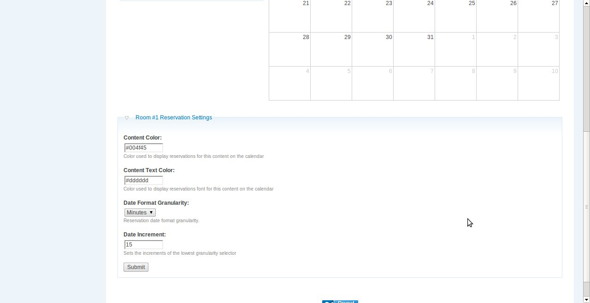

#Drupal Content Reservation Module

## Installation Notes
If you download the latest dev version there is no fullcalendar, you have
to install it separately see the notes in /lib/README, if you download a release
then it is included.

The calendar display uses a higher version of jquery and is incompatible with 
the jquery packaged with drupal, therefore the module searches for the appropriate
version on first run. Once it finds a version then it stores that internally,
if you update fullcalendar after a first install you must run cron for this
variable to be updated if the packaged version of jquery changes, or manually
execute `update_fc_jquery_fname()` somehow.

## Usage Notes
The content reservation module has many options on the admin page at `admin/settings/content_reservation` 
in addition there are content specific options available at the bottom of each content page, if you
have the appropriate permissions (`administer reservations`). These content specific options let you set 
the time granularity for each reservable content, as well as the color it shows up on the calendar. It is
recommended you set each content type to a seperate color so as to easily differentiate them when displayed
on a combined calendar.

## Todo list

### High Priority
* -Menu items
* Usage documentation
* Landing pages for the different available types
* -Option to hide landing page if only one content type
* -Make moderation queue optional
* Create tabbed environment for moderation queue
* -Don't Allow Reservations in the Past
* Pagination or scrolling style for events/moderation
* Styles
* -Email message to user on approve/reject (needs to be tested)
* -add user to displayed info on calendar (optional)
* -Don't show old events

### Low Priority
* Use the sites/all/libraries folder for the calendar
* Make approve / reject moderation ajax callback function
* Adjustable time ranges for reservations
* Generalize the set var functions
* Generalize make url functions
* Make admin page with list of content for whitelist enable
* Human readable time on the conflict resolution message
* Hook into views and panels, and possible provide block for calendar
* Pull the default colors from a system wide variable/admin setting
* Throw a serialized json error on invalid query (returns empty array now)
* Consider change url scheme to work off of get params instead of url slugs for json queries
* Consider making a separate database table for content calendar colors as these may get large
* Make exclusion an array of ids vs singular id in the conflict lookup

## URL Scheme
* /reservations/r/$action_type/$key
	* /reservations/r/type/$content_type
	* /reservations/r/id/$content_id
	* /reservations/r/edit/$reservation_id
* /reservations/j/$query_type/$query_key - Returns an array of fullcalender event objects formatted as json, $query_type is one of either type, nid, uid and $query_key is the appropriate type or id to search for.

